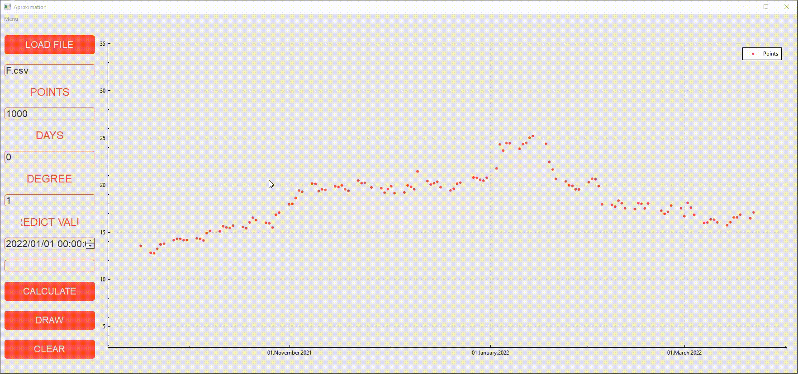
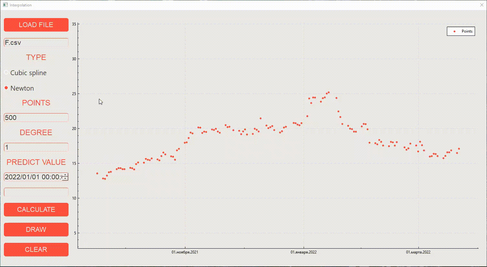

<h1>DOCUMENTATION AlgorithmTraiding</h1>
<h2>LET'S GO!</h2>

AlgorithmTraiding - in project explain work interpolation and approximation algorithms. Using these algorithms, you will be able to plot the probabilistic behavior of stock quotes and their price forecasts for the foreseeable future based on historical data without regard to external factors.

<h4>Aproximation:</h4>

Approximation is a replacement of some mathematical objects by others, in one sense or another, close to the original ones.
    When interpolating, the interpolating function strictly passes through the table nodes because the number of coefficients in the interpolating function is equal to the number of table values.
    Approximation is a method in which the approximated function passes not through the interpolation nodes, but between them in order to find additional values that are different from the table data.
    If the analytical expression of the function is unknown or very complex, then we have to find an empirical formula, the values of which would not differ much from the experimental data.

<h4>Interpolation:</h4>

Interpolation is a method of finding intermediate values of a quantity based on a discrete set of known values.
    Function interpolation is used when you want to find the value of the function at the value of the argument xxx that belongs to the interval are values given in the table), but does not coincide with any of the known values of this interval.
    In many cases, the analytical expression of the function is not known and it is not possible to find the value of this function from the table of its values.

